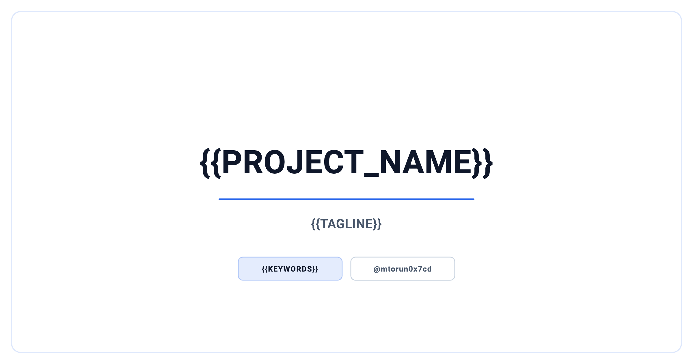

<p align="center">
  <picture>
    <source media="(prefers-color-scheme: dark)" srcset="docs/social_preview_dark.png" />
    <source media="(prefers-color-scheme: light)" srcset="docs/social_preview_light.png" />
    
  </picture>
</p>

# {{PROJECT_NAME}}

> {{TAGLINE}}

Using this template? See [`docs/TEMPLATE.md`](docs/TEMPLATE.md) for the placeholder tokens and instantiation steps.

<p align="center">
  
  
</p>

---

## Overview

{{ABSTRACT}}

## Context

| | |
| --- | --- |
| **Author** | Mert Torun, M.Sc. |
| **Program** | Computer Science & Engineering (Technische Informatik) |
| **Context** | {{CONTEXT}} |

## Features

- {{FEATURE}}

## Architecture

{{ARCHITECTURE}}

## Tech Stack

{{TECH_STACK}}

## Project Structure

```text
{{TREE}}
```

## Getting Started

{{GETTING_STARTED}}

## Documentation

{{DOCUMENTATION}}

## References

{{REFERENCES}}

## Citation

If you reference this work, please cite it via the metadata in [`CITATION.cff`](CITATION.cff).

## Security

See [`SECURITY.md`](SECURITY.md) for the security stance and how to report issues.

## License

Released under the [MIT License](LICENSE).

## Contact

**Mert Torun, M.Sc.** — IT Security Architect · Systems Engineer  
mtorun0x7cd · Research & Development

- **Email**: [info@mtorun0x7cd.com](mailto:info@mtorun0x7cd.com)
- **Website**: [mtorun0x7cd.com](https://mtorun0x7cd.com)
- **LinkedIn**: [linkedin.com/in/mtorun0x7cd](https://www.linkedin.com/in/mtorun0x7cd)
- **GitHub**: [github.com/mtorun0x7cd](https://github.com/mtorun0x7cd)
